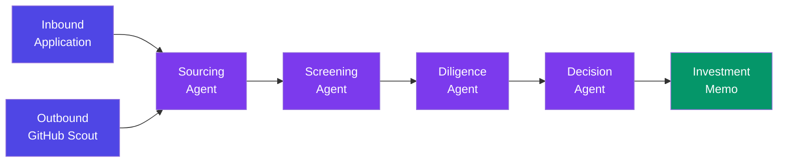

<p align="center">
  <h1 align="center">🔭 ScoutLayer</h1>
  <p align="center"><strong>AI-first venture sourcing & due diligence — evidence over access.</strong></p>
  <p align="center">Built for the <a href="https://lablab.ai">Hack-Nation 6th Global AI Hackathon</a> · Maschmeyer Group "VC Brain" Challenge</p>
</p>

---

## Overview

ScoutLayer replaces the traditional VC deal-sourcing workflow — one that relies on warm intros and gut feeling — with an evidence-based pipeline that surfaces, screens, verifies, and synthesises founder signals into a decision an investor can act on **within 24 hours**, with receipts at every step.

Founders apply directly **or** are discovered proactively from GitHub before they start fundraising. Both paths converge into a single funnel and flow through four AI agent stages, each producing auditable, citation-backed artefacts.

---

## Architecture — The 4-Agent Pipeline

```
┌─────────────────────────────────────────────────────────────────┐
│                        Next.js App Router                       │
│  ┌──────────────┐  ┌──────────────────┐  ┌───────────────────┐  │
│  │  Founder UI  │  │   Investor UI    │  │   API Routes      │  │
│  │  /apply      │  │   /dashboard     │  │   /api/pipeline   │  │
│  │  /dashboard  │  │   /founder/[id]  │  │   /api/screen     │  │
│  │              │  │   /scout         │  │   /api/diligence   │  │
│  │              │  │   /search        │  │   /api/memo        │  │
│  └──────────────┘  └──────────────────┘  └────────┬──────────┘  │
│                                                    │             │
└────────────────────────────────────────────────────┼─────────────┘
                                                     │
              ┌──────────────────────────────────────┘
              ▼
┌──────────────────────────────────────────────────────────────────┐
│                       AI Agent Pipeline                          │
│                                                                  │
│  ┌────────────┐  ┌────────────┐  ┌────────────┐  ┌────────────┐ │
│  │  Sourcing  │→ │ Screening  │→ │ Diligence  │→ │  Decision  │ │
│  │  (Planner) │  │(Specialist)│  │ (Verifier) │  │(Synthesizer│ │
│  └────────────┘  └────────────┘  └────────────┘  └────────────┘ │
│       │                │               │               │         │
│    GitHub API       Groq LLM      Tavily Search     Groq LLM    │
│                                   + OpenAI                       │
└──────────────────────────────────────────────────────────────────┘
              │
              ▼
       ┌──────────┐
       │ MongoDB  │
       │  Atlas   │
       └──────────┘
```

### Multi-Agent Roles

| Stage | Agent Role | What It Does | LLM |
|---|---|---|---|
| **Sourcing** | Planner | Ingests raw signals (GitHub repos, profiles, deck text) and structures them into `founders.structuredProfile`. Handles cold-start detection — founders with sparse public history are flagged, not silently deprioritized. | — (data gathering) |
| **Screening** | Specialist | Scores three axes independently — **Founder**, **Market**, **Idea-vs-Market** — with trend tracking (improving / declining / stable). Axes are never averaged into a composite score. | Groq (`gpt-oss-120b`) |
| **Diligence** | Verifier | Extracts claims from the structured profile, cross-checks each against live web evidence via Tavily, and computes per-claim Trust Scores (0–100) with source URLs. Contradictions are surfaced, not buried. | OpenAI (`gpt-4.1-mini`) |
| **Decision** | Synthesizer | Compiles everything into an investment memo: Company Snapshot, Investment Hypotheses, SWOT, Problem & Product, Traction & KPIs. Missing data is labelled "not disclosed" — never fabricated. Computes a persistent Founder Score. | Groq (`gpt-oss-120b`) |



---

## Tech Stack

| Layer | Technology |
|---|---|
| Framework | [Next.js 16](https://nextjs.org) (App Router, TypeScript) |
| Styling | [Tailwind CSS v4](https://tailwindcss.com) |
| Database | [MongoDB Atlas](https://www.mongodb.com/atlas) |
| Auth | [NextAuth.js](https://next-auth.js.org) (Google OAuth) |
| Fast LLM | [Groq](https://groq.com) — sourcing & screening (`openai/gpt-oss-120b`) |
| Reasoning LLM | [OpenAI](https://openai.com) — diligence verification (`gpt-4.1-mini`) |
| Web Search | [Tavily](https://tavily.com) — claim verification |
| PDF Export | [@react-pdf/renderer](https://react-pdf.org) — memo download |
| Icons | [Lucide React](https://lucide.dev) |

---

## Getting Started

### Prerequisites

- Node.js 18+
- MongoDB Atlas cluster (or local MongoDB)
- API keys for Groq, OpenAI, Tavily, and a GitHub Personal Access Token
- Google OAuth credentials (for NextAuth)

### Setup

```bash
# Clone the repo
git clone https://github.com/samkielio/scoutlayer.git
cd scoutlayer

# Install dependencies
npm install

# Copy env template and fill in your keys
cp .env.example .env

# Run the dev server
npm run dev
```

Open [http://localhost:3000](http://localhost:3000).

### Environment Variables

See [`.env.example`](.env.example) for the full list. All variables are required:

| Variable | Purpose |
|---|---|
| `GROQ_API_KEY` | Groq API key for screening & decision agents |
| `OPENAI_API_KEY` | OpenAI API key for diligence verification |
| `TAVILY_API_KEY` | Tavily API key for web-evidence claim verification |
| `GITHUB_PAT` | GitHub Personal Access Token for outbound sourcing (5k req/hr) |
| `MONGODB_URI` | MongoDB connection string |
| `NEXTAUTH_SECRET` | Random secret for NextAuth JWT signing |
| `NEXTAUTH_URL` | Base URL of the app (e.g. `http://localhost:3000`) |
| `GOOGLE_CLIENT_ID` | Google OAuth client ID |
| `GOOGLE_CLIENT_SECRET` | Google OAuth client secret |

---

## Project Structure

```
scoutlayer/
├── agents/                 # AI agent definitions
│   ├── sourcing.ts         #   Inbound + GitHub outbound sourcing
│   ├── screening.ts        #   Three-axis independent scoring
│   ├── diligence.ts        #   Per-claim trust verification
│   └── decision.ts         #   Investment memo generation
├── app/
│   ├── (auth)/             # Login / sign-up pages
│   ├── (founder)/
│   │   └── founder/
│   │       ├── apply/      # Founder application form
│   │       └── dashboard/  # Founder status dashboard
│   ├── (investor)/
│   │   └── investor/
│   │       ├── dashboard/  # Ranked pipeline view
│   │       ├── founder/    # Per-founder deep-dive + memo
│   │       ├── scout/      # Outbound GitHub scouting
│   │       └── search/     # Natural-language query interface
│   ├── api/                # Server-side API routes
│   └── page.tsx            # Landing page
├── components/             # Shared UI components
│   ├── EvidenceReceipt.tsx #   Trust claim evidence display
│   ├── PipelineStepper.tsx #   Visual pipeline progress
│   ├── MemoPdfDocument.tsx #   PDF memo template
│   └── ...
├── lib/
│   ├── sources/            # Data source connectors (GitHub, deck parser)
│   ├── query/              # NL → MongoDB filter translation
│   └── utils/              # Truncation, trust score, cascade delete
├── types/                  # TypeScript type definitions
└── middleware.ts           # Role-based route gating
```

---

## Key Design Decisions

1. **Three axes, never averaged.** Founder quality, market size, and idea-market fit are scored independently. An investor can filter on any axis without a composite score masking a weak signal.

2. **Trust Scores with receipts.** Every claim in a founder profile is verified against web evidence. The confidence level and source URL are stored — investors see exactly what was checked and what wasn't.

3. **Cold-start flagging, not penalising.** Founders with sparse public profiles (< 20 followers, no bio, no company) are explicitly flagged for manual review. They are never silently dropped from the pipeline.

4. **Persistent Founder Score.** A founder's score follows them across multiple applications, building a longitudinal signal over time.

5. **Gap-flagging, not fabrication.** Missing data in the investment memo is labelled "not disclosed". The system never generates data to fill gaps.

---

## Judging Criteria Alignment

### 1. Data Architecture
- MongoDB schema designed around the full pipeline lifecycle: `founders`, `applications`, `screenings`, `trustClaims`, `memos`, `pipelineRuns`
- Every pipeline run is logged with timestamped entries for full auditability
- `structuredProfile` normalises heterogeneous signals (GitHub API data, deck text, user-submitted info) into one schema

### 2. Intelligent Analysis & Trust
- Three independent screening axes with per-axis trend tracking, avoiding composite-score masking
- Per-claim Trust Scores (0–100) verified via Tavily web search with citation URLs
- Cold-start detection flags sparse profiles for manual review rather than silently penalising
- The Verifier agent explicitly surfaces contradictions and low-confidence evidence

### 3. Investment Utility
- Generates structured investment memos with Company Snapshot, SWOT, Investment Hypotheses, Problem & Product, Traction & KPIs
- Explicit gap-flagging: missing data is labelled "not disclosed", never fabricated
- Downloadable PDF memos via `@react-pdf/renderer`
- Persistent Founder Score builds longitudinal signal across applications

### 4. User Experience
- Dual-persona app: separate flows for founders (apply, track status) and investors (dashboard, deep-dive, scout, search)
- Real-time pipeline progress via streaming (SSE) with visual stepper UI
- Natural-language search translates investor queries into MongoDB filters
- Role-based auth and middleware routing via NextAuth + Google OAuth

---

## Known Limitations

Being upfront about current gaps — judges respect honesty over silence:

- **GitHub is the sole outbound sourcing channel.** LinkedIn, Twitter/X, and AngelList integrations are not built. Founders who are not active on GitHub will only enter via the inbound application path.
- **Market axis relies on lightweight repo-signal inference, not deep market research.** TAM, competitive landscape, and timing signals are inferred from repo metadata and LLM reasoning rather than from dedicated market-data APIs or financial databases.
- **Deck analysis is limited to public Google Slides links.** PDF, Notion, Canva, and other deck formats are detected but not parsed — the system explicitly discloses this gap in downstream stages rather than skipping silently.
- **No real-time rate-limit recovery on Tavily.** If the Tavily API rate-limits during diligence, affected claims are marked "unverified" rather than retried. This is disclosed in the Trust Score output.
- **Single-model dependency per stage.** Screening and decision depend on Groq's `gpt-oss-120b`; diligence on OpenAI `gpt-4.1-mini`. No automatic fallback to alternative models is implemented.
- **No portfolio-level analytics.** The current build operates at the individual-founder level. Cross-portfolio views (sector heat maps, deal velocity metrics) are not implemented.

---

## Credits

Built by **SAMKIEL** for the **Hack-Nation 6th Global AI Hackathon** — [https://hack-nation.ai/](https://hack-nation.ai/) — [Maschmeyer Group "VC Brain" Challenge](https://www.mgv.vc/), in collaboration with the **MIT Club of Northern California** and the **MIT Club of Germany**.

---

## License

MIT
