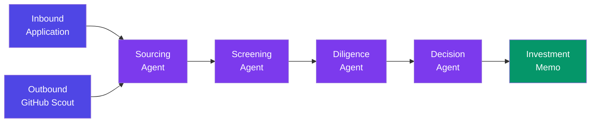

<p align="center">
  <h1 align="center">🔭 ScoutLayer</h1>
  <p align="center"><strong>AI-first venture sourcing & screening — built for the Maschmeyer Group "VC Brain" challenge.</strong></p>
  <p align="center">Surface exceptional founders on evidence, not network access.</p>
</p>

---

## What It Does

ScoutLayer turns fragmented founder signals into a decision an investor can act on **within 24 hours** — with receipts at every step.

Founders apply directly **or** are discovered from GitHub before they start fundraising. Both paths converge into one funnel and flow through four pipeline stages:

| Stage | What happens |
|---|---|
| **Sourcing** | Inbound applications + outbound GitHub discovery. Raw signals are structured into a unified founder profile. |
| **Screening** | Three independent scoring axes — **Founder**, **Market**, **Idea-vs-Market** — each with trend tracking. Scores are never averaged into a single number. |
| **Diligence** | Per-claim **Trust Scores** verified against real web evidence via Tavily + OpenAI. Contradictions are surfaced, not buried. |
| **Decision** | An investment memo with explicit gap-flagging. Missing data is labelled `"not disclosed"` — never fabricated. |

A persistent **Founder Score** follows each person across applications. Cold-start founders with sparse public history are explicitly flagged, not silently deprioritized.

---

## Architecture

```
┌─────────────────────────────────────────────────────────────────┐
│                        Next.js App Router                       │
│  ┌──────────────┐  ┌──────────────────┐  ┌───────────────────┐  │
│  │  Founder UI  │  │   Investor UI    │  │   API Routes      │  │
│  │  /apply      │  │   /dashboard     │  │   /api/pipeline   │  │
│  │  /dashboard  │  │   /founder/[id]  │  │   /api/screen     │  │
│  │              │  │   /scout         │  │   /api/diligence   │  │
│  │              │  │   /search        │  │   /api/memo        │  │
│  └──────────────┘  └──────────────────┘  └────────┬──────────┘  │
│                                                    │             │
└────────────────────────────────────────────────────┼─────────────┘
                                                     │
              ┌──────────────────────────────────────┘
              ▼
┌──────────────────────────────────────────────────────────────────┐
│                       AI Agent Pipeline                          │
│                                                                  │
│  ┌────────────┐  ┌────────────┐  ┌────────────┐  ┌────────────┐ │
│  │  Sourcing  │→ │ Screening  │→ │ Diligence  │→ │  Decision  │ │
│  │   Agent    │  │   Agent    │  │   Agent    │  │   Agent    │ │
│  └────────────┘  └────────────┘  └────────────┘  └────────────┘ │
│       │                │               │               │         │
│    GitHub API       Groq LLM      Tavily Search     OpenAI      │
│                                                                  │
└──────────────────────────────────────────────────────────────────┘
              │
              ▼
       ┌──────────┐
       │ MongoDB  │
       │  Atlas   │
       └──────────┘
```

### Multi-Agent System

| Agent | Role | LLM |
|---|---|---|
| **Sourcing Agent** | Ingests raw signals (GitHub repos, profiles) and structures them into `founders.structuredProfile`. Handles cold-start detection. | Groq |
| **Screening Agent** | Scores the three axes independently with trend indicators (improving / declining / stable). | Groq |
| **Verifier Agent** | Extracts claims from the structured profile, cross-checks each against web evidence via Tavily, computes per-claim Trust Scores. | OpenAI |
| **Synthesizer Agent** | Compiles the investment memo from screening + trust data. Flags gaps and contradictions. Never fabricates data. | OpenAI |

---

## Tech Stack

| Layer | Technology |
|---|---|
| Framework | [Next.js 16](https://nextjs.org) (App Router, TypeScript) |
| Styling | [Tailwind CSS v4](https://tailwindcss.com) |
| Database | [MongoDB Atlas](https://www.mongodb.com/atlas) |
| Auth | [NextAuth.js](https://next-auth.js.org) (Google OAuth) |
| Fast LLM | [Groq](https://groq.com) — sourcing & screening |
| Reasoning LLM | [OpenAI](https://openai.com) — diligence & decision |
| Web Search | [Tavily](https://tavily.com) — claim verification |
| PDF Export | [@react-pdf/renderer](https://react-pdf.org) — memo download |
| Icons | [Lucide React](https://lucide.dev) |

---

## Getting Started

### Prerequisites

- Node.js 18+
- MongoDB Atlas cluster (or local MongoDB)
- API keys for Groq, OpenAI, Tavily, and a GitHub PAT
- Google OAuth credentials (for NextAuth)

### Setup

```bash
# Clone the repo
git clone https://github.com/your-username/scoutlayer.git
cd scoutlayer

# Install dependencies
npm install

# Copy env template and fill in your keys
cp .env.example .env

# Run the dev server
npm run dev
```

Open [http://localhost:3000](http://localhost:3000).

### Environment Variables

```env
# API Keys
GROQ_API_KEY=
OPENAI_API_KEY=
TAVILY_API_KEY=
GITHUB_PAT=

# Database
MONGODB_URI=

# Authentication (NextAuth)
NEXTAUTH_SECRET=
NEXTAUTH_URL=http://localhost:3000
GOOGLE_CLIENT_ID=
GOOGLE_CLIENT_SECRET=
```

---

## Project Structure

```
scoutlayer/
├── agents/                 # AI agent definitions
│   ├── sourcing.ts         #   Inbound + GitHub outbound sourcing
│   ├── screening.ts        #   Three-axis independent scoring
│   ├── diligence.ts        #   Per-claim trust verification
│   └── decision.ts         #   Investment memo generation
├── app/
│   ├── (auth)/             # Login / sign-up pages
│   ├── (founder)/
│   │   └── founder/
│   │       ├── apply/      # Founder application form
│   │       └── dashboard/  # Founder status dashboard
│   ├── (investor)/
│   │   └── investor/
│   │       ├── dashboard/  # Ranked pipeline view
│   │       ├── founder/    # Per-founder deep-dive + memo
│   │       ├── scout/      # Outbound GitHub scouting
│   │       └── search/     # Natural-language query interface
│   ├── api/
│   │   ├── applications/   # CRUD for applications
│   │   ├── diligence/      # Trust score computation
│   │   ├── founders/       # Founder profile endpoints
│   │   ├── memo/           # Memo generation + retrieval
│   │   ├── pipeline/       # Pipeline orchestration
│   │   ├── query/          # NL → MongoDB filter translation
│   │   ├── scout/          # Outbound sourcing triggers
│   │   └── screen/         # Screening execution
│   └── page.tsx            # Landing page
├── components/             # Shared UI components
│   ├── EvidenceReceipt.tsx #   Trust claim evidence display
│   ├── PipelineStepper.tsx #   Visual pipeline progress
│   ├── MemoPdfDocument.tsx #   PDF memo template
│   └── ...
├── lib/
│   ├── sources/            # Data source connectors (GitHub, deck parser)
│   ├── pipeline/           # Pipeline stage orchestration
│   ├── query/              # NL query processing
│   └── utils/              # Shared utilities
├── types/                  # TypeScript type definitions
└── middleware.ts           # Role-based route gating
```

---

## Key Design Decisions

1. **Three axes, never averaged.** Founder quality, market size, and idea-market fit are scored independently. An investor can filter on any axis without a composite score masking a weak signal.

2. **Trust Scores with receipts.** Every claim in a founder profile is verified against web evidence. The confidence level and source URL are stored — investors see exactly what was checked and what wasn't.

3. **Cold-start flagging, not penalizing.** Founders with sparse public profiles (`< 20 followers`, no bio, no company) are explicitly flagged for manual review. They are never silently dropped from the pipeline.

4. **Persistent Founder Score.** A founder's score follows them across multiple applications, building a longitudinal signal over time.

5. **Gap-flagging, not fabrication.** Missing data in the investment memo is labelled `"not disclosed"`. The system never generates data to fill gaps.

---

## How the Pipeline Works



1. **Sourcing** — Founder applies via form **or** investor runs a thesis-driven GitHub scout. Raw signals are structured into a unified profile. Cold-start founders are flagged.

2. **Screening** — Three specialist sub-agents score independently:
   - **Founder Axis** — technical depth, execution history, domain expertise
   - **Market Axis** — TAM, timing, competitive landscape
   - **Idea-vs-Market Axis** — product-market fit evidence, differentiation

3. **Diligence** — Claims are extracted from the profile and verified against live web data via Tavily. Each claim gets a Trust Score (0–100) with a source URL.

4. **Decision** — The synthesizer compiles everything into an investment memo with sections: Company Snapshot, Investment Hypotheses, SWOT, Problem & Product, Traction & KPIs. Gaps are explicitly flagged.

---

## Built By

**SAMKIEL** — solo build for the [Maschmeyer Group "VC Brain" Hackathon Challenge](https://www.mgv.vc/).

---

## License

MIT
